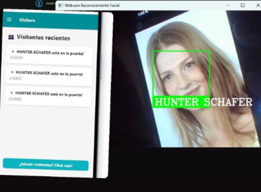
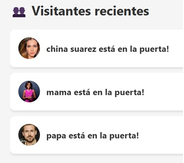

# 🏠 Sense-Bell - Smart Doorbell System  

## 📝 Description  

**Sense-Bell** is a cross-platform mobile application built with **React Native** that transforms your smartphone into a **smart doorbell and visitor management system**.  

Key capabilities:  
- 🔍 **Real-time monitoring** via live camera feed  
- 🔔 **Instant notifications** when visitors arrive  
- 👤 **Visitor registration** with photo capture  
- ⚙️ **Customizable settings** for personalized experience  

## ✨ Core Features  

### 🔔 **Smart Notifications**  
- 📲 Push notifications with vibration/haptic feedback  
- 🕒 Historical log of all doorbell events  
- 🗑️ Easy management (delete single/all notifications)  

### 👥 **Visitor Management**  
- 📸 Visitor registration with photos and priority levels that translates into haptic feedback via PWM on the wearable device
- 📋 View recent visitor logs with timestamps  
- ✏️ Edit/delete visitor entries  





### 📹 **Live Camera**  
- 🎥 Real-time streaming renderization from ESP32 camera module 
- 💡 Remote flash control  
- 🔄 Automatic reconnection if stream drops  

### ⚙️ **Settings**  
- 👤 Profile picture customization  
- 🔕 Notification preferences  
- 📳 Haptic feedback toggle  

## 🛠️ Tech Stack  

| Category          | Technologies Used |
|-------------------|-------------------|
| **Frontend**      | React Native (iOS/Android/Web) |
| **Navigation**    | React Navigation (Stack + Drawer) |
| **Database**      | Firebase Realtime Database & Storage |
| **Storage**       | Firebase Storage |
| **Notifications** | Expo Notifications |
| **State**         | Context API |

## 🚀 Installation  

1. **Clone the repo**  
   ```bash
   git clone https://github.com/your-username/sense-bell.git
   cd sense-bell
